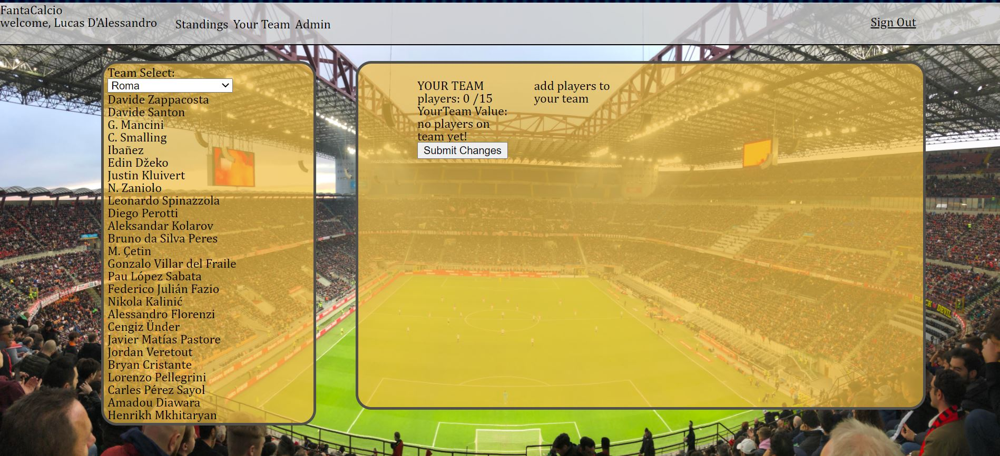
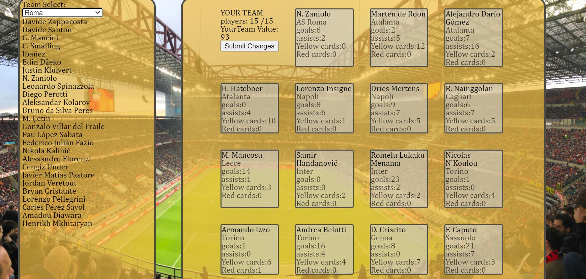
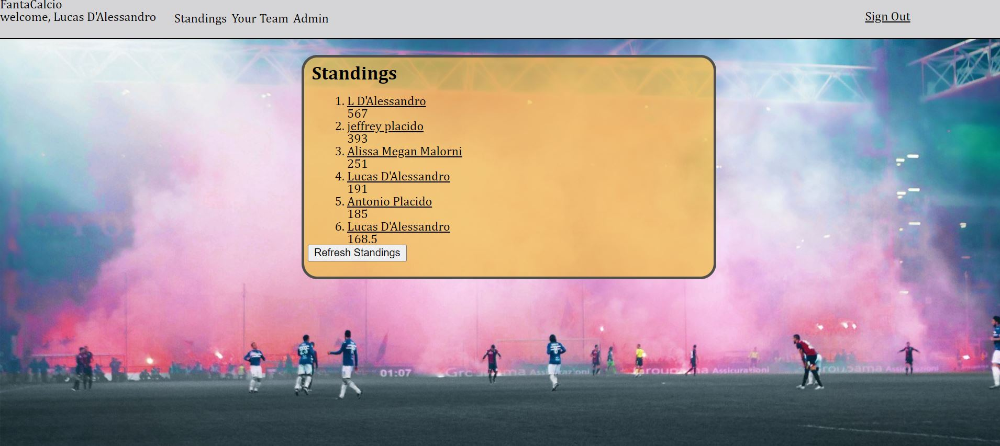
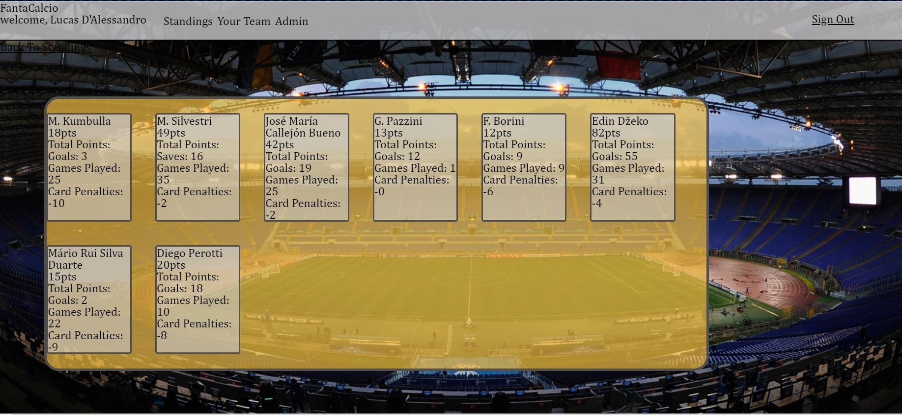

## Fantacalcio

by Lucas D'Alessandro

## About the app

This was the first application I created Solo from beginning to end within the context of a bootcamp done summer 2020. It is a fantasy soccer game created for myself and my friends to enjoy for the upcoming season.

The application is quite simple in structure with the bulk of the work done in the backend and relies heavily on calls [to this api](https://www.api-football.com/)

# How it works:

The user logs in and creates a team on the team details page, they can select up to 15 players while respecting a budget of 100. Player values were assigned by myself based on my knowledge of the players, the default value for each player was 5. Max value was 10.

Once the team is created the team is stored in mongo, where on a weekly basis stats are updated via a function on the admin page. This function calls the api updates the stats for the week, and based on the algorithm assigns each player a score and in turn an overall user score.

Standings are reflected on the standings page where the user can track the weekly progress as well as see the other teams that have been selected.

# updates to come and overall thoughts:

As stated earlier, this was my first app. It was built in roughly two weeks and i am quite proud of the work done, especially with the back end. Having said that, i plan on making the following changes in order to clean up the code and fix overall game play.

mainly:

-Cleaning up backend functions as well as fetches and making them more modular. As i continued to code the app i noticed alot of repitition, this is something to work on.

-Polish the overall look of the app and the CSS. I ran out of time and was focused on functionality over form in order to meet deadline for my bootcamp.

-Fixing gameplay, as of now the way the app is based on the assumption that teams will not be changed over the course of a season. i would like to implement a way to allow a max of 3 changes as well as a new way to calculate and store point totals

thank you for taking the time to go through this, im really excited to have begun this journey.

oh and DAJE ROMA DAJE!!!
